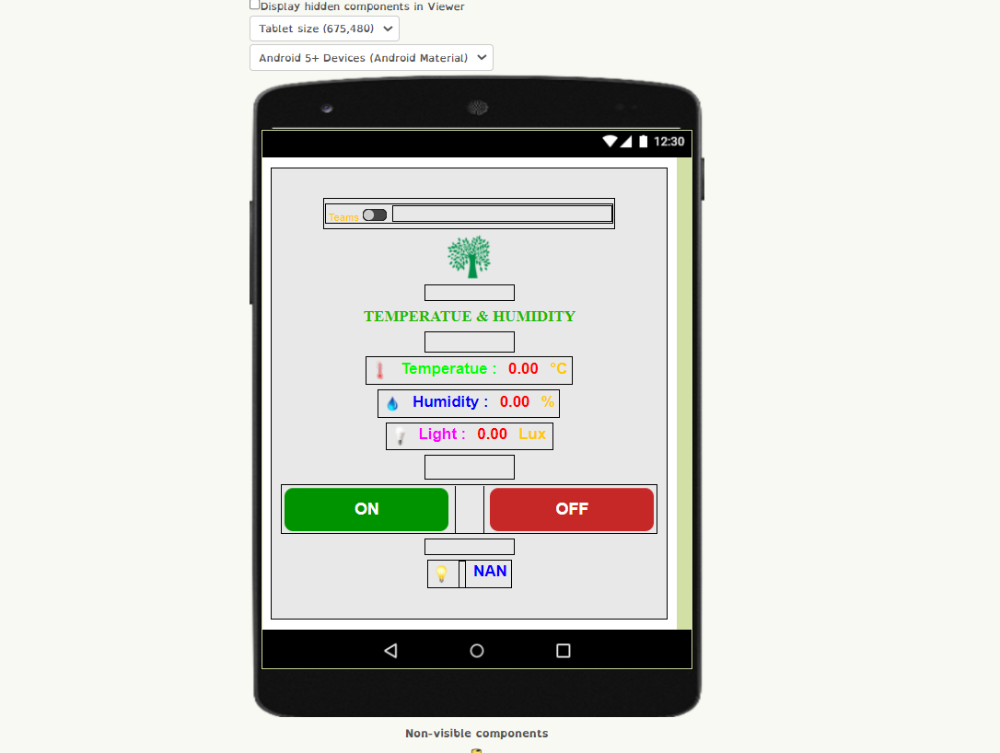
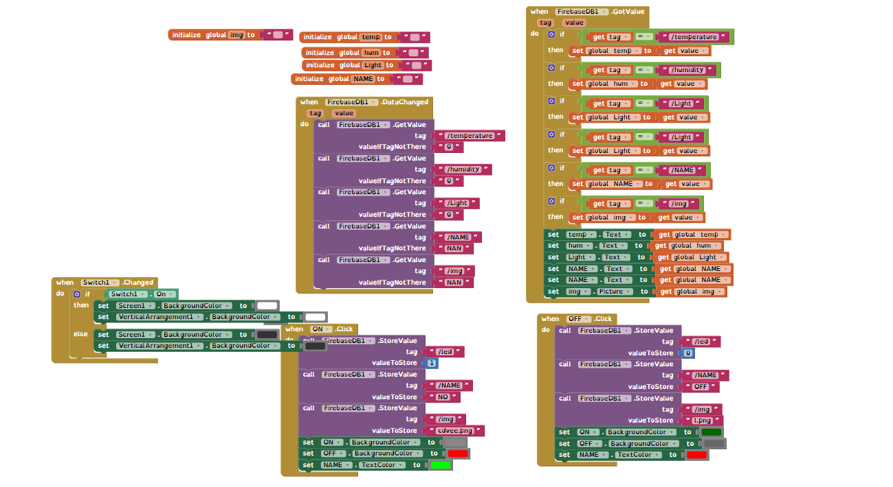
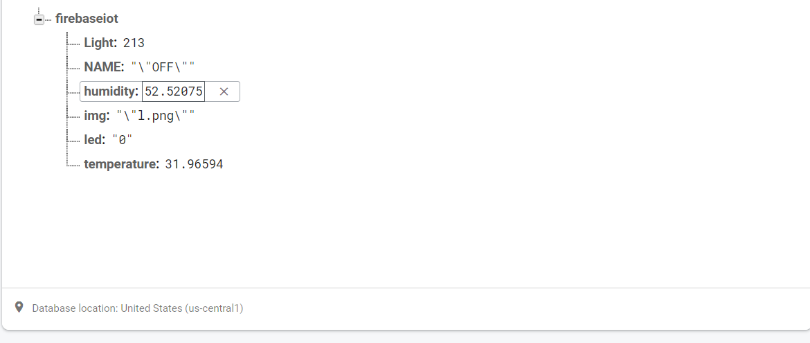
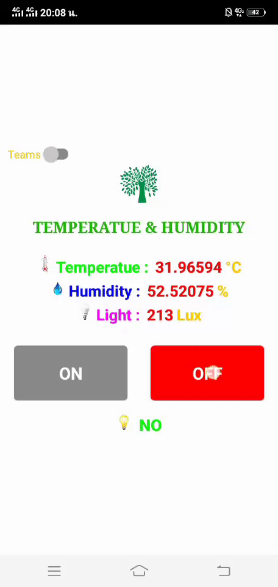

# Esp-32
#### APP_IOT_fire 
- Build App use https://appinventor.mit.edu/
##### GUI

##### Block

##### URL

-  Could : https://firebase.google.com/

- Example : https://www.youtube.com/watch?v=3RPJtL2rnXc Example of connecting blocks

- circuit connection

